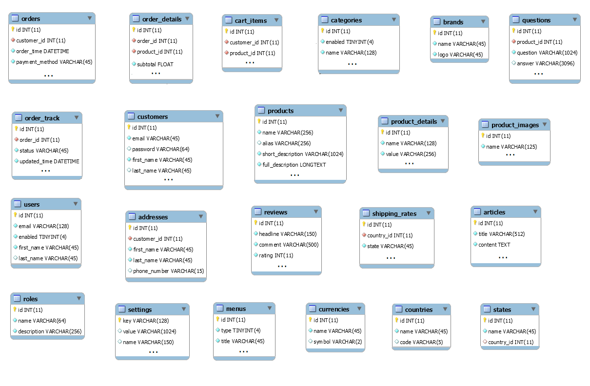
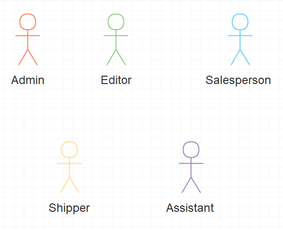
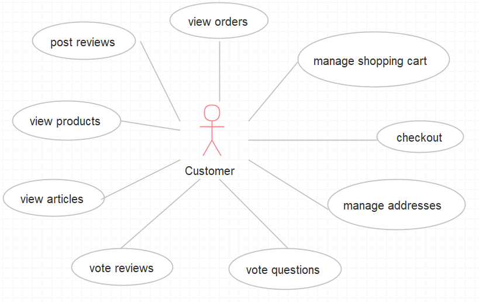
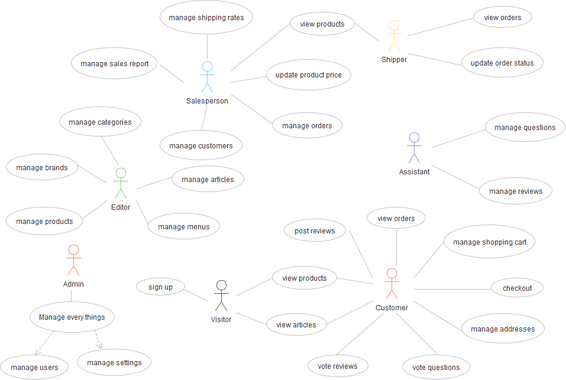

# E-commerce Spring-boot

## DESCRIPTION

Multi-module e-commerce Spring-boot project: Manage user, product, and order data with authentication, authorization, and secure password handling. Ensures payment security and fast response times. Scalable backend and frontend for performance
#### Screenshots

<p align="center">




<p>

## Security and Performance Features

### Security
To ensure the highest level of security for our e-commerce platform:
- **Authentication:** Mandatory for all users, with the exception of visitors, to verify their identity.
- **Authorization:** Strictly enforced in the admin control panel based on user roles to ensure only authorized personnel can access sensitive areas of the platform.
- **Password Storage:** Passwords are not stored directly in the database to protect user information.
- **Payment Security:** All payment transactions are secured to safeguard financial information.

### Performance
Our platform is designed for optimal performance, ensuring a seamless user experience:
- **Response Time:** The application maintains a fast response time to user interactions.
- **Request Handling:** No request takes longer than 4 seconds, ensuring efficiency and user satisfaction.
- **Scalability:** Both the back-end and front-end applications are designed to be scaled separately to handle varying loads effectively.

## Key Actors

- **Admin:** Manages site operations, user permissions, and configurations.
- **Editor:** Oversees content creation, updates, and maintenance.
- **Salesperson:** Handles product listings, inventory, and order processing.
- **Customer:** Engages with the site through purchasing, order management, and feedback provision.
- **Visitor:** Explores the site without engaging in transactions or account creation.

## Use Cases

### Admin
- **User Account and Permission Management:** Ensures that only authorized users can access certain functionalities based on their roles.
- **Site Configuration:** Customizes site settings and preferences to improve user experience and operational efficiency.
- **Performance Monitoring:** Keeps track of site analytics and performance to identify and address issues promptly.
- **Customer Support:** Manages escalations and provides support to resolve customer issues effectively.

### Customer
- **Product Browsing:** Allows customers to explore various products and categories.
- **Shopping Cart Management:** Enables adding items to the shopping cart and proceeding to checkout.
- **Order Tracking:** Provides updates on order status and shipment details for better customer service.
- **Feedback Provision:** Offers a platform for customers to provide ratings and reviews, enhancing the shopping experience.


## Pre-requisites

To get started with our e-commerce website development using Spring Boot, certain pre-requisites must be in place. This section outlines the necessary technologies, frameworks, and tools required to build, secure, and operate the platform efficiently. Given the complexity and the need for a robust solution, we've chosen specific technologies and frameworks that align with our goals for security, performance, scalability, and user experience.

### Core Technologies & Frameworks

1. **Java Development Kit (JDK):** Ensure you have the latest version of JDK installed to support Spring Boot and its ecosystem for backend development.

2. **Spring Boot:** Our primary framework for creating microservices. Spring Boot makes it easy to create stand-alone, production-grade Spring based Applications that you can "just run".

3. **Spring Security:** To handle authentication and authorization, ensuring that only authenticated users can access certain functionalities based on their roles.

4. **Spring Data JPA:** For database operations, making it easier to implement data access layers and manage relational databases.

5. **Lombok:** A Java library that automatically plugs into your editor and build tools, spicing up your java. Never write another getter or equals method again, with one annotation your class has a fully featured builder, Automate your logging variables, and much more.

### Payment and Image Storage

1. **PayPal SDK:** For integrating PayPal payment functionalities into the platform. Ensure to set up a PayPal developer account and obtain the necessary credentials (Client ID and Secret) for the sandbox and live environments.

2. **AWS S3 or Similar Service:** For image storage. AWS S3 is recommended for its scalability, security, and reliability. However, any similar service that suits the project requirements and budget can be considered.

### Development Tools

1. **Maven:** As a build tool for managing project dependencies and building the project. Ensure to familiarize yourself with the one chosen for this project.

2. **IDE:** An Integrated Development Environment such as IntelliJ IDEA, Eclipse, or Spring Tool Suite (STS) for efficient coding and debugging.

3. **Postman or Swagger:** For testing and interacting with the REST APIs developed in Spring Boot.

4. **Git:** For version control, to manage code changes and collaborate with other developers.

5. **Database:** A relational database such as `MySQL`, `PostgreSQL`, or any similar RDBMS supported by Spring Data JPA for storing and managing application data.


## **SETUP/INSTALLATION!**

Before starting the development, make sure to:

1. Install and configure all the pre-requisite tools and frameworks mentioned above.
2. Set up the development environment, including the IDE and the build tools.
3. Configure the `application.properties` or `application.yml` file in your Spring Boot project to include database connections, PayPal SDK configurations, and any other required properties.
4. Understand the basic concepts of Spring Boot, Spring Security, JPA, and other used frameworks to effectively utilize their functionalities.
5. Link: ```https://github.com/tonnymuchui/shopping```

3. From there you can access **shopping**.

4. **Clone** the project.

5. **get into project folder** (cd into project).

6. If you have all the **Pre-requisites**

7. Open your **IDE and run the Application**.


## How to contribute

All contributions are welcome, from code to documentation to graphics to design suggestions to bug reports. Please use GitHub to its fullest. Whatever you have to offer, we can use it!


## Support & Contact

- Mobile number: (+254) 721270949

- Email Address: tonykanyingah@gmail.com

- github-username: [tonnymuchui](https://github.com/tonnymuchui)

## LICENSE

This project is licensed under the **MIT License** - see the [LICENSE](LICENSE) file for details.